# Database Schema

This document shows the current SQLite schema for OffGridOS as a Mermaid entity-relationship diagram.

The database is currently organized as a single-project workspace, not as a multi-tenant schema.

```mermaid
erDiagram
    LOCATIONS {
        INTEGER id PK
        TEXT title
        TEXT country
        TEXT place_name
        TEXT description
        TEXT notes
        REAL latitude
        REAL longitude
        REAL northing
        REAL easting
        TEXT site_photo_data_url
    }

    SURFACES {
        INTEGER id PK
        TEXT surface_id UK
        TEXT name
        TEXT description
        INTEGER sort_order
        REAL orientation_deg
        REAL tilt_deg
        REAL area_height_m
        REAL area_width_m
        REAL usable_area_m2
        TEXT notes
        TEXT photo_data_url
    }

    PANEL_TYPES {
        INTEGER id PK
        TEXT panel_type_id UK
        TEXT brand
        TEXT model
        REAL wp
        REAL voc
        REAL vmp
        REAL isc
        REAL imp
        REAL length_mm
        REAL width_mm
        TEXT notes
        REAL price
        TEXT price_source_url
    }

    CABINET_TYPES {
        INTEGER id PK
        TEXT cabinet_type_id UK
        TEXT title
        TEXT description
        REAL depth_mm
        REAL width_mm
        REAL height_mm
        TEXT units
        REAL price
        TEXT price_source_url
        INTEGER condensation_protection
        INTEGER insect_protection
        INTEGER dust_protection
        INTEGER outside_protection
        INTEGER frost_protection
        INTEGER fire_protection
        TEXT ip_rating
        TEXT insurance_rating
    }

    SURFACE_PANEL_ASSIGNMENTS {
        INTEGER id PK
        TEXT surface_id FK
        TEXT panel_type_id FK
        INTEGER count
    }

    PV_ARRAYS {
        INTEGER id PK
        TEXT array_id UK
        TEXT surface_id UK, FK
        TEXT name
        TEXT panel_type_id FK
        INTEGER panel_count
        INTEGER panels_per_string
        INTEGER parallel_strings
        REAL installed_wp
        TEXT notes
    }

    PV_STRINGS {
        INTEGER id PK
        TEXT string_id UK
        TEXT array_id FK
        TEXT surface_id FK
        INTEGER string_index
        TEXT panel_type_id FK
        INTEGER panel_count
    }

    ARRAY_TO_MPPT_MAPPINGS {
        INTEGER id PK
        TEXT mapping_id UK
        TEXT array_id UK, FK
        TEXT selected_mppt_type_id FK
    }

    SURFACE_CONFIGURATIONS {
        INTEGER id PK
        TEXT surface_id UK, FK
        INTEGER panels_per_string
        INTEGER parallel_strings
        TEXT selected_mppt_type_id FK
    }

    MPPT_TYPES {
        INTEGER id PK
        TEXT mppt_type_id UK
        TEXT brand
        TEXT model
        INTEGER tracker_count
        REAL max_voc
        REAL max_pv_power
        REAL max_pv_input_current_a
        REAL max_pv_short_circuit_current_a
        REAL max_charge_current
        REAL nominal_battery_voltage
        REAL price
        TEXT price_source_url
        TEXT notes
    }

    BATTERY_TYPES {
        INTEGER id PK
        TEXT battery_type_id UK
        TEXT brand
        TEXT model
        TEXT chemistry
        REAL nominal_voltage
        REAL capacity_ah
        REAL capacity_kwh
        REAL max_charge_rate
        REAL max_discharge_rate
        INTEGER victron_can
        TEXT cooling
        REAL price
        REAL price_per_kwh
        TEXT price_source_url
        TEXT notes
    }

    BATTERY_BANK_CONFIGURATIONS {
        INTEGER id PK
        TEXT battery_bank_id UK
        TEXT title
        TEXT description
        TEXT image_data_url
        TEXT notes
        TEXT selected_battery_type_id FK
        TEXT selected_cabinet_type_id FK
        TEXT selected_dc_busbar_id FK
        INTEGER configured_battery_count
        INTEGER batteries_per_string
        INTEGER parallel_strings
    }

    DC_BUSBARS {
        INTEGER id PK
        TEXT dc_busbar_id UK
        TEXT title
        TEXT description
    }

    INVERTER_TYPES {
        INTEGER id PK
        TEXT inverter_id UK
        TEXT brand
        TEXT model
        REAL input_voltage_v
        REAL output_voltage_v
        REAL continuous_power_w
        REAL peak_power_va
        REAL max_charge_current_a
        REAL efficiency_pct
        REAL price
        TEXT price_source_url
        TEXT notes
    }

    INVERTER_CONFIGURATIONS {
        INTEGER id PK
        TEXT inverter_configuration_id UK
        TEXT title
        TEXT description
        TEXT image_data_url
        TEXT notes
        TEXT selected_inverter_type_id FK
        TEXT selected_cabinet_type_id FK
        TEXT selected_dc_busbar_id FK
    }

    CONVERSION_DEVICES {
        INTEGER id PK
        TEXT conversion_device_id UK
        TEXT title
        TEXT description
        TEXT device_type
        REAL input_voltage_v
        REAL output_voltage_v
        REAL continuous_power_w
        REAL peak_power_va
        REAL max_charge_current_a
        REAL efficiency_pct
        REAL output_ac_voltage_v
        REAL frequency_hz
        REAL surge_power_w
        REAL output_dc_voltage_v
        REAL max_output_current_a
        REAL price
        TEXT price_source_url
        TEXT notes
    }

    PROJECT_CONVERTERS {
        INTEGER id PK
        TEXT project_id FK
        TEXT location_id FK
        TEXT project_converter_id UK
        TEXT title
        TEXT description
        TEXT conversion_device_id FK
    }

    LOAD_CIRCUITS {
        INTEGER id PK
        TEXT load_circuit_id UK
        TEXT location_id FK
        TEXT project_converter_id FK
        TEXT conversion_device_id FK
        TEXT title
        TEXT description
    }

    LOADS {
        INTEGER id PK
        TEXT load_id UK
        TEXT load_circuit_id FK
        TEXT title
        TEXT description
        REAL nominal_current_a
        REAL nominal_power_w
        REAL startup_current_a
        REAL surge_power_w
        REAL standby_power_w
        REAL expected_usage_hours_per_day
        REAL daily_energy_kwh
        TEXT duty_profile
        TEXT notes
        REAL usage_kw
        REAL spike_kw
        REAL sleeping_kw
    }

    PROJECT_PREFERENCES {
        TEXT key PK
        TEXT value
    }

    LOCATIONS ||--o| PROJECT_PREFERENCES : "shared project context"
    SURFACES ||--o{ SURFACE_PANEL_ASSIGNMENTS : "has"
    PANEL_TYPES ||--o{ SURFACE_PANEL_ASSIGNMENTS : "used by"
    SURFACES ||--o| PV_ARRAYS : "has"
    PV_ARRAYS ||--o{ PV_STRINGS : "has"
    PV_ARRAYS ||--o| ARRAY_TO_MPPT_MAPPINGS : "selected for"
    SURFACES ||--o| SURFACE_CONFIGURATIONS : "has"
    MPPT_TYPES ||--o{ SURFACE_CONFIGURATIONS : "selected for"
    BATTERY_TYPES ||--o{ BATTERY_BANK_CONFIGURATIONS : "selected for"
    CABINET_TYPES ||--o| BATTERY_BANK_CONFIGURATIONS : "selected for"
    DC_BUSBARS ||--o{ BATTERY_BANK_CONFIGURATIONS : "selected for"
    INVERTER_TYPES ||--o{ INVERTER_CONFIGURATIONS : "selected for"
    DC_BUSBARS ||--o{ INVERTER_CONFIGURATIONS : "selected for"
    CONVERSION_DEVICES ||--o{ LOAD_CIRCUITS : "serves"
    LOCATIONS ||--o{ PROJECT_CONVERTERS : "contains"
    CONVERSION_DEVICES ||--o{ PROJECT_CONVERTERS : "selected for"
    PROJECT_CONVERTERS ||--o{ LOAD_CIRCUITS : "feeds"
    LOAD_CIRCUITS ||--o{ LOADS : "contains"
```

## Notes

- `locations` holds the shared project site coordinates plus optional title, description, notes, and site photo.
- the legacy `location` table has been removed; `locations` is now the only supported site table.
- `surfaces` defines the roof geometry; `area_height_m` and `area_width_m` feed the computed `usable_area_m2` field.
- `cabinet_types` stores the reusable 19 inch rack cabinet catalog entries.
- `cabinet_types.units` is stored as text so cabinet capacities such as `42U` or `48U` stay readable in the UI and export.
- `battery_bank_configurations.selected_cabinet_type_id`, `battery_bank_configurations.selected_dc_busbar_id`, `inverter_configurations.selected_cabinet_type_id`, and `inverter_configurations.selected_dc_busbar_id` link the respective configurations to one optional cabinet type or busbar.
- `dc_busbars` stores the shared DC distribution point between the battery bank and downstream branches.
- `surface_panel_assignments` stores the current panel assignment per surface.
- `pv_arrays`, `pv_strings`, and `array_to_mppt_mappings` persist the current PV topology layer and stay synchronized with the surface configuration.
- `surface_configurations` stores per-surface string layout and MPPT choice.
- `battery_bank_configurations` stores the current battery-bank sizing choice plus optional title, description, notes, and image.
- `mppt_types`, `battery_types`, `panel_types`, and `inverter_types` are catalog tables; all carry a `brand` field.
- `battery_types.max_charge_rate` and `max_discharge_rate` are in amps (A).
- `battery_types.price_source_url` supersedes the legacy `source` and `url` fields, which are still present for backwards compatibility.
- `inverter_configurations` stores the selected inverter setup plus optional title, description, notes, and image.
- `conversion_devices` stores the unified inverter and converter catalog entries for the load side.
- `project_converters` stores the location-level converter instances used by the consumption workflow.
- `load_circuits` stores protected load-side circuits behind one conversion device and within the active location.
- `loads` stores the individual load items attached to a load circuit, with neutral electrical fields for current, power, and usage plus legacy kW aliases kept for compatibility during migration, and they remain location-owned through their parent circuit.
- `loads` inherit supply type and voltage context from their parent load circuit's attached conversion device.
- `project_preferences` uses `key` as its primary key (no separate `id` column).
- monthly solar output by surface is currently derived at export time rather than stored as a base table.
- the project-level monthly solar total is the sum of those derived surface monthly outputs.

The schema is intentionally small and still assumes one active project and one active location at a time while the boundary refactor lands. If OffGridOS later grows into a multi-user or multi-project tool, this doc should be updated alongside the schema.
