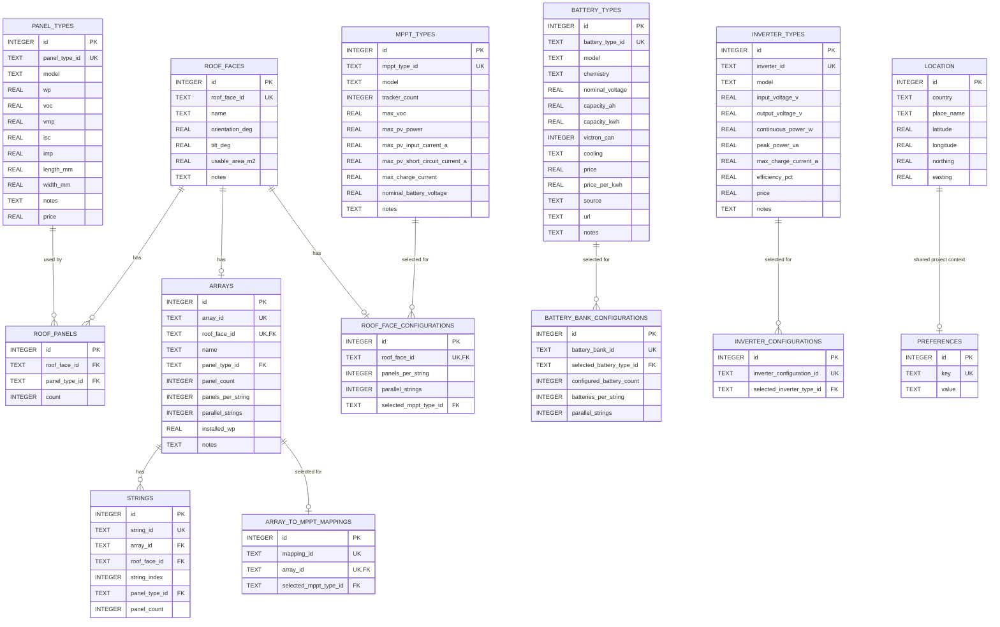

# Database Schema

This document shows the current SQLite schema for OffGridOS as a Mermaid entity-relationship diagram.

The database is currently organized as a single-project workspace, not as a multi-tenant schema.

## Notes

- `location` holds the shared project site coordinates.
- `roof_faces` defines the roof geometry that the current project uses.
- `roof_panels` stores the current panel assignment per roof face.
- `arrays`, `strings`, and `array_to_mppt_mappings` persist the current PV topology layer and stay synchronized with the roof-face configuration.
- `roof_face_configurations` stores per-face string layout and MPPT choice.
- `battery_bank_configurations` stores the current battery-bank sizing choice.
- `mppt_types`, `battery_types`, and `inverter_types` are catalog tables.
- `inverter_configurations` stores the selected inverter setup.
- `preferences` currently stores the remaining project preferences.
- monthly solar output by roof face is currently derived at export time rather than stored as a base table.
- the project-level monthly solar total is the sum of those derived roof-face monthly outputs.

The schema is intentionally small and still aimed at one project at a time. If OffGridOS later grows into a multi-user or multi-project tool, this doc should be updated alongside the schema.
