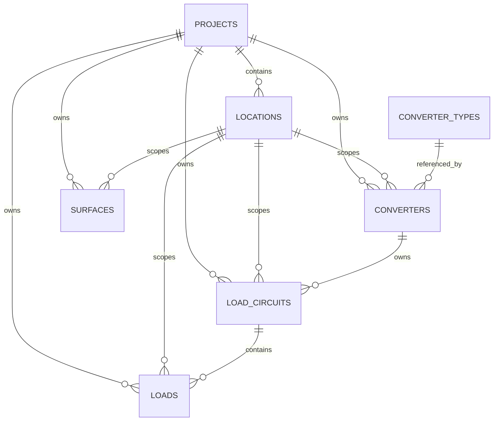

# Database

## Overview

OffGridOS uses a project-scoped SQLite database for both persisted project inputs and catalog data. The current working setup starts with one active project, but the schema is intended to grow to multiple projects. The schema is intentionally compact, with the PV topology, battery-bank configuration, inverter configuration, the shared DC busbar, and the new load-side model each stored as explicit rows.

The intended ownership boundary between project-scoped catalogue data and location-scoped configuration is documented in [project-location-boundary.md](./project-location-boundary.md).
The app-wide page state, naming, and scope conventions are documented in [app-organisation.md](./app-organisation.md).

## Core Tables

- `locations`: shared site metadata for the project
- `surfaces`: roof or mounting surfaces
- `panel_types`: reusable PV panel catalog entries
- `pv_arrays` and `pv_strings`: persisted PV topology for each surface, with explicit project and location ownership
- `mppt_types` and `mppt_configurations`: MPPT catalog and selected MPPT setup
- `battery_types` and `battery_bank_configurations`: battery catalog and selected battery-bank setup
- `inverter_types` and `inverter_configurations`: inverter catalog and selected inverter setup, both owned by the active location
- `dc_busbars`: shared DC distribution points between the battery bank and downstream branches
- `converter_types`, `converters`, `load_circuits`, and `loads`: the load-side model for downstream electrical demand, with converters, circuits, and loads owned by the active location

## Schema Sketch

Reading the sketch:

- `project` is the top-level boundary
- `location` is the site boundary inside the project
- catalogue rows stay reusable within the project
- project instances such as `converters` carry the user-facing title and description
- child rows such as `load_circuits` and `loads` inherit their parent context instead of reselecting it inside the editor

## Scope Convention

The preferred ownership rule follows three buckets:

- global catalog tables have no `project_id` and no `location_id`
- project-wide tables have `project_id` and `location_id = null`
- location-owned tables have both `project_id` and `location_id`

This is a design convention for the app and schema, not a built-in SQLite feature.
Boundary tables such as `projects` and `locations` may be exceptions where carrying both scope columns would not clarify ownership.

## Load-Side Model

- `converter_types` unifies inverter-like and converter-like devices behind one catalog table and now mirrors the inverter catalog bridge; its identifier is `converter_type_id`
- each `converter_type` includes an explicit `output_voltage_v` field for the device output domain
- `converters` stores the location-level converter instances shown on `Consumption`; each row has its own `converter_id`, its own title and description, and references one catalog `converter_type`
- `dc_busbars` stores the shared DC distribution point for the battery-bank side of the system
- `battery_bank_configurations.selected_dc_busbar_id` and `inverter_configurations.selected_dc_busbar_id` optionally link those configurations to one shared busbar
- `load_circuits` groups one or more loads behind one protected distribution point within a location, links to the owning `converter_id`, and carries the inherited supply type and voltage context through its attached converter
- `loads` stores the individual electrical loads within a location and their own electrical inputs, such as nominal current, nominal power, surge power, standby power, duty profile, and optional daily energy
- Location-owned tables now persist both `project_id` and `location_id` explicitly on disk, instead of inheriting scope through parent rows.

## Naming Review

Some table names are already clear because they match the ubiquitous language.
Others should be reviewed as the model stabilizes.

Current review candidates:

- `converters`: clear and aligned with the user-facing label
- `converter_types`: clear enough, but still technical rather than user-facing
- `load_circuits`: clear in intent and a good current term
- `loads`: clear in intent and a good current term
- `inverter_configurations`: clear enough and now explicitly location-owned
- `dc_busbars`: acceptable, but worth revisiting if the UI ever needs a more user-facing synonym
- `battery_bank_configurations`, `inverter_configurations`, `mppt_configurations`, `surface_configurations`: clear enough, though long
- `project_preferences`: clear
- `pv_arrays` and `pv_strings`: clear in the current PV terminology

The rule of thumb is simple:

- if the table name is hard to explain in one sentence, it is probably too vague
- if the name mixes catalogue meaning with instance meaning, it should be reviewed
- if the name does not match the user-facing label, the mismatch should be deliberate and documented

## Lifecycle Fields

Mutable tables may benefit from explicit timestamp columns:

- `created_at`
- `updated_at`

SQLite will not maintain those lifecycle fields automatically for application behavior, so they must be added explicitly when needed.

## Identifier Rule

When a table is created or updated, its primary key should normally carry the table name rather than use a bare `id`.

Preferred examples:

- `locations.location_id`
- `surfaces.surface_id`
- `converter_types.converter_type_id`
- `converters.converter_id`
- `load_circuits.load_circuit_id`
- `loads.load_id`

Foreign keys should reference that identifier name directly, such as `converter_type_id` or `converter_id`.

If a table still uses a bare `id`, treat that as a candidate for future migration work rather than as the default pattern.

The `locations` table is already on the canonical shape: `location_id` is the primary key and the old surrogate `id` is no longer part of the table design.

## Notes

- `load_circuits` and `loads` are the current canonical replacements for the older downstream distribution wording, and they now follow the location boundary instead of the broader project boundary.
- The legacy `arrays`, `strings`, `preferences`, `roof_faces`, `roof_panels`, and `roof_face_configurations` tables were retired once the canonical schema was in place.
- Derived totals, load-circuit sizing, and fuse suggestions remain calculation outputs rather than persisted summary columns.
- The living table/relationship diagram lives in this file.
