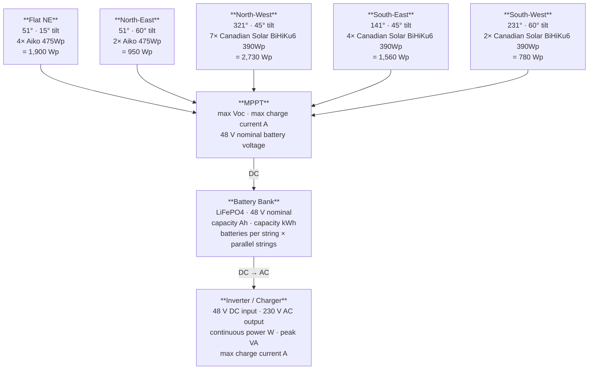

# Energy Flow Diagram

```mermaid
flowchart TD
    FlatNE["**Flat NE**\n51° · 15° tilt\n4× Aiko 475Wp\n= 1,900 Wp"]
    NE["**North-East**\n51° · 60° tilt\n2× Aiko 475Wp\n= 950 Wp"]
    NW["**North-West**\n321° · 45° tilt\n7× Canadian Solar BiHiKu6 390Wp\n= 2,730 Wp"]
    SE["**South-East**\n141° · 45° tilt\n4× Canadian Solar BiHiKu6 390Wp\n= 1,560 Wp"]
    SW["**South-West**\n231° · 60° tilt\n2× Canadian Solar BiHiKu6 390Wp\n= 780 Wp"]

    MPPT["**MPPT**\nmax Voc · max charge current A\n48 V nominal battery voltage"]

    Inverter["**Inverter / Charger**\n48 V DC input · 230 V AC output\ncontinuous power W · peak VA\nmax charge current A"]

    Battery["**Battery Bank**\nLiFePO4 · 48 V nominal\ncapacity Ah · capacity kWh\nbatteries per string × parallel strings"]

    FlatNE --> MPPT
    NE     --> MPPT
    NW     --> MPPT
    SE     --> MPPT
    SW     --> MPPT

    MPPT     -->|"DC"| Battery
    Battery  -->|"DC → AC"| Inverter
```

Total panel capacity across all surfaces: **7,920 Wp**

- Aiko 475Wp (Flat NE + NE): 6 panels · 2,850 Wp
- Canadian Solar BiHiKu6 390Wp (NW + SE + SW): 13 panels · 5,070 Wp
